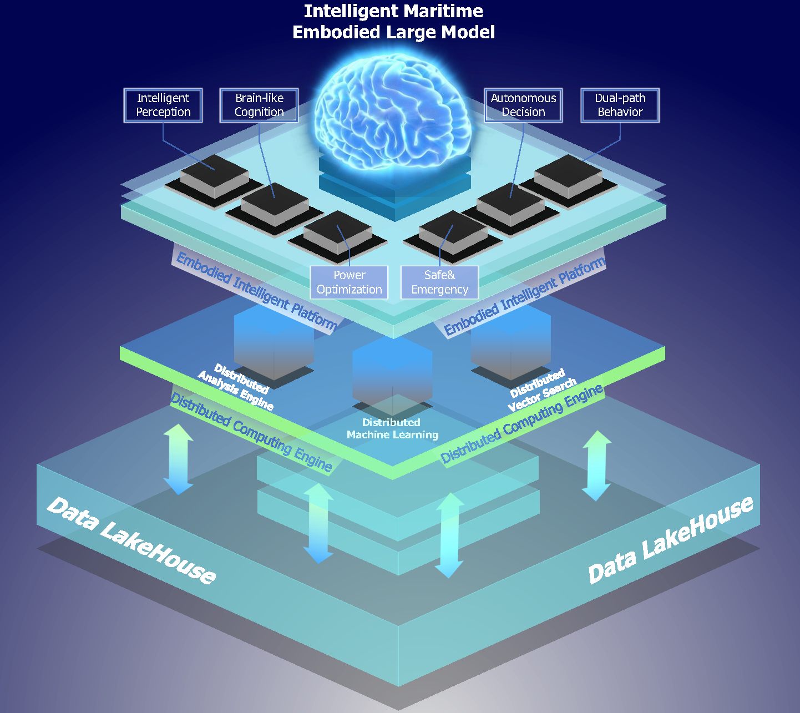
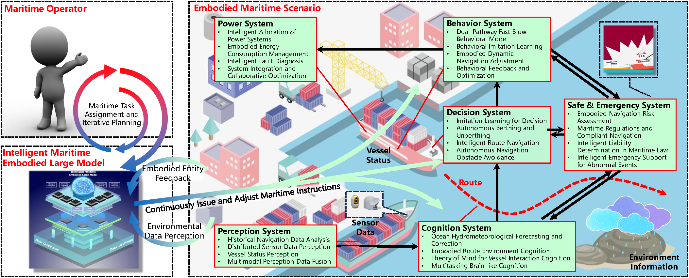

# [KUNPENG: An Embodied Large Model for Intelligent Maritime](https://arxiv.org/abs/2407.09048)
This is the implementation of the intelligent maritime embodied large model named KUNPENG.

Subsequent updates will be coming soon.

# Introduction
Intelligent maritime, as an essential component of smart ocean construction, deeply integrates advanced artificial intelligence technology and data analysis methods, which covers multiple aspects such as smart vessels, route optimization, safe navigation, aiming to enhance the efficiency of ocean resource utilization and the intelligence of transportation networks. However, the complex and dynamic maritime environment, along with diverse and heterogeneous large-scale data sources, present challenges for real-time decision-making in intelligent maritime. In this paper, We propose KUNPENG, the first-ever embodied large model for intelligent maritime in the smart ocean construction, which consists of six systems. The model perceives multi-source heterogeneous data for the cognition of environmental interaction and make autonomous decision strategies, which are used for intelligent vessels to perform navigation behaviors under safety and emergency guarantees and continuously optimize power to achieve embodied intelligence in maritime. In comprehensive maritime task evaluations, KUNPENG has demonstrated excellent performance. 



# KUNPENG
Intelligent maritime of the KUNPENG embodied large model, including Perception System, Cognition System, Decision System, Behavior System, Power System, and Safe and Emergency System.


# Citations
```bibtex
@misc{wang2024kunpengembodiedlargemodel,
      title={KUNPENG: An Embodied Large Model for Intelligent Maritime}, 
      author={Naiyao Wang and Tongbang Jiang and Ye Wang and Shaoyang Qiu and Bo Zhang and Xinqiang Xie and Munan Li and Chunliu Wang and Yiyang Wang and Hongxiang Ren and Ruili Wang and Hongjun Shan and Hongbo Liu},
      year={2024},
      eprint={2407.09048},
      archivePrefix={arXiv},
      primaryClass={cs.AI},
      url={https://arxiv.org/abs/2407.09048}, 
}
```
